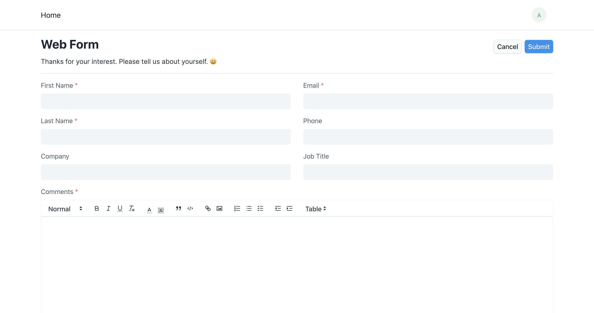
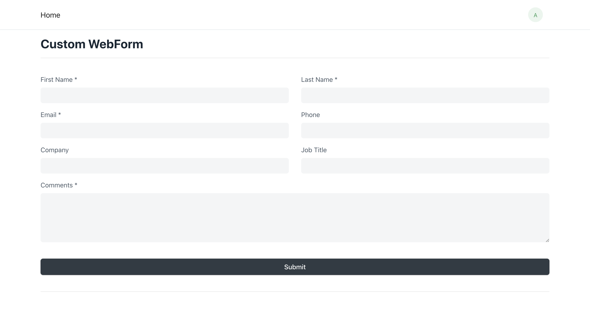
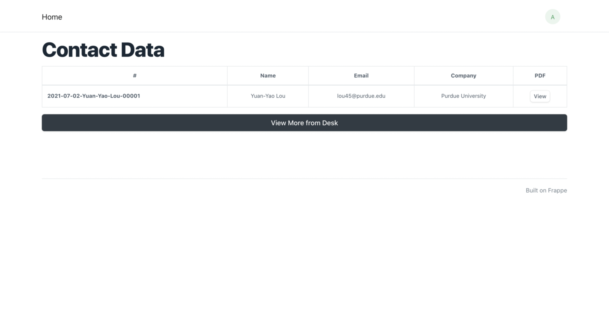
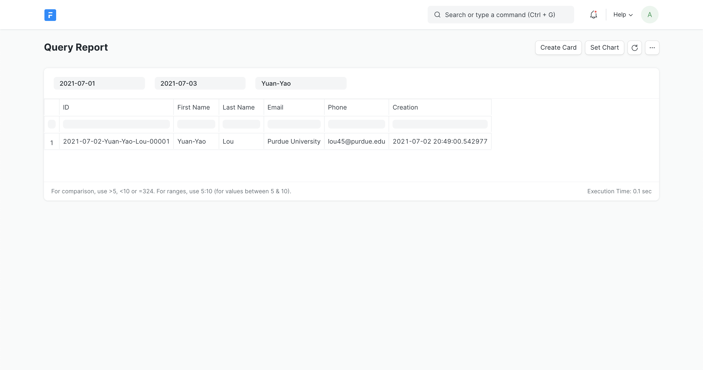
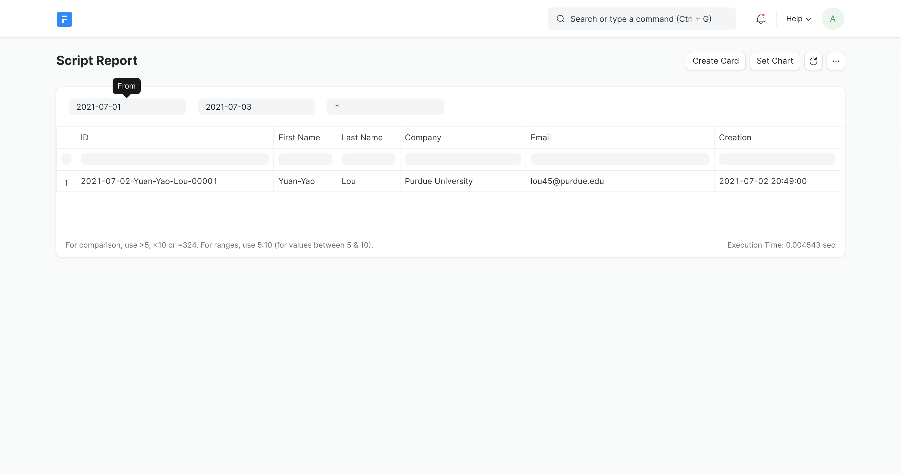

# Frappe Apps Development
This repository aims at providing general usage of Frappe framework and steps to build Frappe Apps.
* Basic
  * [Usage of Frappe Bench](#basic-usage)  
* Web
  * [WebForm and DocType](#web-form)  
  * [Custom WebForm](#custom-web-form)  
  * [Custom Page to Retrieve DocType Data](#custom-page)  
* Report
  * [Query Type](#query-report)  
  * [Script Type](#script-report)  
* Integration
  * [Bootstrap 5](#bootstrap-5)  
  * [AdminLTE v3](#admin-lte)

<br>

<a name="basic-usage"/>

## Basic - Usage of Frappe Bench
```shell
# Create New Frappe App / Get Existing Frappe App
bench new-app     <APP_NAME>
bench get-app     <GIT_URL>

# Install Frapp App to Frapp Site
bench --site      <SITE_NAME>           \
      install-app <APP_NAME>
      
# Frappe DB Backup / Restore
bench --site      <SITE_NAME>           \
      backup  --backup-path <ABS_PATH>  \

bench --site      <SITE_NAME>           \
      restore     <BACKUP_DB_GZ_FILE>
```

<br>
<br>

<a name="web-form"/>

## Web - WebForm and DocType


```INI
# ==================================================================================
#  Reference Settings                      (refer to JSON file for more details)   =
# ==================================================================================
# Folder Structure: APP_NAME/MODULE_NAME/TYPE/NAME

[Module] web-form            (Folder: erp-app/web_form)

[Type]
DocType = Web Form Data      (Folder: erp-app/web_form/doctype/web_form_data)
WebForm = Web Form           (Folder: erp-app/web_form/web_form/web_form)

[Permission]
DocType = Guest: Read, Write, Create
```
1. Create **'Module'** under your Frapp app
2. Create **'DocType'** to store web form data under the related module ([JSON](https://github.com/devbeno/erp-app/blob/main/erp-app/web_form/doctype/web_form_data/web_form_data.json))
```INI
[Fileds]
/-----------------------------------------------------------------\
|     Label     |     Type     |     Name     |     Mandatory     |
|-----------------------------------------------------------------|
|  First Name   |  Data        |  first_name  |  Yes              |
|  Last Name    |  Data        |  last_name   |  Yes              |
|  Phone        |  Data        |  phone       |                   |
|  Email        |  Data        |  email       |  Yes              |
|  Company      |  Data        |  company     |                   |
|  Job Title    |  Data        |  job_title   |                   |
|  Comments     |  Data        |  comments    |  Yes              |
\-----------------------------------------------------------------/
```
3. Create **'WebForm'** linked with the DocType and Module above ([JSON](https://github.com/devbeno/erp-app/blob/main/erp-app/web_form/web_form/web_form/web_form.json))
```INI
[Fileds]
/-----------------------------------------------------------------\
|       Fieldname       |        Fieldtype        |     Label     |
|-----------------------------------------------------------------|
|  first_name           |  Data                   |  First Name   |
|  last_name            |  Data                   |  Last Name    |
|                       |  Column Break           |               |
|  email                |  Data                   |  Email        |
|  phone                |  Data                   |  Phone        |
|                       |  Section Break          |               |
|  company              |  Data                   |  Company      |
|                       |  Column Break           |               |
|  job_title            |  Data                   |  Job Title    |
|                       |  Section Break          |               |
|  comments             |  Text Editor            |  Comments     |
\-----------------------------------------------------------------/
```
4. Input data via WebForm web page or via REST API (Guest is allowed due to permission settings)
```shell
# URL Format: <DOMAIN>/api/resource/<DOCTYPE>

curl -X POST https://<DOMAIN>/api/resource/Web%20Form%20Data    \
     -H 'Content-Type: application/json'                       \
     -H 'Accept: application/json'                             \
     -d '{"first_name":"Guest", "last_name":"Test", "email":"guest.test@example.com", "comments":"Hello World"}'
```

<br>
<br>

<a name="custom-web-form"/>

## Web - Custom WebForm


```INI
[File] 
HTML       = custom-web-form.html   (Folder: erp-app/www)
Javascript = custom_web_form.js     (Folder: erp-app/www)
Python     = custom_web_form.py     (Folder: erp-app/www)
```
1. Create HTML, Javascript (client-side), and Python (server-side) files under **'www'** folder
2. Design 'Form' in [HTML](https://github.com/devbeno/erp-app/blob/main/erp-app/www/custom-web-form.html), Front-end reactions in [Javascript](https://github.com/devbeno/erp-app/blob/main/erp-app/www/custom_web_form.js), and Back-end response in [Python](https://github.com/devbeno/erp-app/blob/main/erp-app/www/custom_web_form.py)

<br>
<br>

<a name="custom-page"/>

## Web - Custom Page to Retrieve DocType Data


```INI
[File] 
HTML       = retrieve-data.html     (Folder: erp-app/www)
Python     = retrieve_data.py       (Folder: erp-app/www)
```
1. Create HTML and Python (server-side) files under **'www'** folder
2. Design 'Table' in [HTML](https://github.com/devbeno/erp-app/blob/main/erp-app/www/retrieve-data.html) and Back-end response in [Python](https://github.com/devbeno/erp-app/blob/main/erp-app/www/retrieve_data.py) (here we get Frappe data by **'frappe.get_list'**)

<br>
<br>

<a name="query-report"/>

## Report - Query Type


```INI
# ==================================================================================
#  Reference Settings                      (refer to JSON file for more details)   =
# ==================================================================================
# Folder Structure: APP_NAME/MODULE_NAME/TYPE/NAME

[DocType] Web Form Data        (Folder: erp-app/web_form/doctype/web_form_data)
[Module]  report               (Folder: erp-app/report)

[Type]
Report  = Query Report         (Folder: erp-app/report/report/query_report)

[File]
Javascript = query_report.js   (Folder: erp-app/report/report/query_report)
```
1. Create **'Module'** under your Frapp app
2. Create **'Report'** linked with the DocType and Module above ([JSON](https://github.com/devbeno/erp-app/blob/main/erp-app/report/report/query_report/query_report.json))
3. Add required information in the **'Columns'** and **'Filters'** sections (referred to following table content)
```INI
[Columns]
/-------------------------------------------------\
|    Fieldname    |    Label    |    Fieldtype    |
|-------------------------------------------------|
|  id             |  ID         |  Data           |
|  first_name     |  First Name |  Data           |
|  last_name      |  Last Name  |  Data           |
|  email          |  Email      |  Data           |
|  phone          |  Phone      |  Data           |
|  creation       |  Creation   |  Data           |
\-------------------------------------------------/

[Filters]
/-------------------------------------------------\
|    Fieldname    |    Label    |    Fieldtype    |
|-------------------------------------------------|
|  from_date      |  From       |  Date           |
|  to_date        |  To         |  Date           |
|  first_name     |  First Name |  Data           |
\-------------------------------------------------/
```
4. Create [Javascript](https://github.com/devbeno/erp-app/blob/main/erp-app/report/report/query_report/query_report.js), for filtering purpose
```Javascript
/*
 *  @path      erp-app/report/report/query_report
 *  @filename  query_report.js
 */ 

frappe.query_reports['Query Report'] = {
    "filters": [
        {
            'fieldname':    'from_date',
            'label':        __( 'From' ),
            'fieldtype':    'Date',
	      'default':      '2021-01-01',
            'reqd':         1
        },
        {
            'fieldname':    'to_date',
            'label':        __( 'To' ),
            'fieldtype':    'Date',
	      'default':      get_today(),
            'reqd':         1
        },
        {
            'fieldname':    'first_name',
            'label':        __( 'First Name' ),
            'fieldtype':    'Data',
	      'default':      '%',
            'reqd':         1
        },
    ]
}
```

<br>
<br>

<a name="script-report"/>

## Report - Script Type


```INI
# ==================================================================================
#  Reference Settings                      (refer to JSON file for more details)   =
# ==================================================================================
# Folder Structure: APP_NAME/MODULE_NAME/TYPE/NAME

[DocType] Web Form Data        (Folder: erp-app/web_form/doctype/web_form_data)
[Module]  report               (Folder: erp-app/report)

[Type]
Report  = Script Report        (Folder: erp-app/report/report/script_report)

[File]
Javascript = script_report.js  (Folder: erp-app/report/report/script_report)
Python     = script_report.py  (Folder: erp-app/report/report/script_report)
```
1. Create **'Report'** linked with the DocType and Module (.js and .py will be generated automatically) ([JSON](https://github.com/devbeno/erp-app/blob/main/erp-app/report/report/script_report/script_report.json))
2. Modify **['script_report.js'](https://github.com/devbeno/erp-app/blob/main/erp-app/report/report/script_report/script_report.js)** to enable filtering functions so that server-side script (Python) could catch it
3. Modify **['script_report.py'](https://github.com/devbeno/erp-app/blob/main/erp-app/report/report/script_report/script_report.py)** to deal with table format and how filtering functinos work and response to client-side
4. Build the app
```shell
# Frappe command 'bench build' will execute 'npm run build' for each Frappe app with package.json
bench build --app erp-app
```
